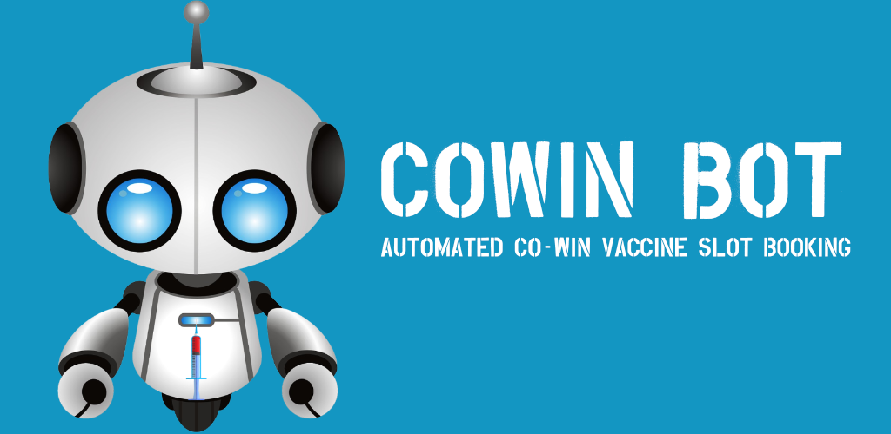

# COWIN Bot

  

## Android mobile app to automatically login and book COVID-19 vaccine slots in India

The sole purpose of the CowinBot app is to help non tech savvy people with booking their Covid-19 vaccine in a fast manner.

It is always recommended to use Indian government co-win website [https://www.cowin.gov.in/] to book your vaccine slot. 

Together we can make the world Covid safe

I am not charging anything for this - this will be FREE of cost forever.

## Why only Android?

Only Android provides automated SMS reading capability 

## Features
  
🤖 - Simple and very intuitive user interface

🤖 - Automatically generate and confirm OTP

🤖 - Notifies you with what the bot is doing

🤖 - Sound alarm when a slot is available in the specified range

🤖 - Download the booking receipt with in the app

🤖 - Cancel scheduled appointment within the app

🤖 - Bot make sure that it is not overloading Co-Win website

🤖 - Spread the word if you like the app

🤖 - Buy me a coffee by donating to https://patreon.com/adarshtp 🙏🏻

## Demo

https://www.youtube.com/watch?v=Vivy4ObIdnY

## Download for Android

Click <a href="CoWinBot.apk">HERE</a>

## Notice of Non-Affiliation and Disclaimer

I are not affiliated, associated, authorized, endorsed by, or in any way officially connected with the [Ministry of Health and Family Welfare of India](https://www.india.gov.in/ "Ministry of Health and Family Welfare"), or any of its subsidiaries or its affiliates. The official Ministry of Health and Family Welfare Cowin registration website can be found at [www.cowin.gov.in].

Please use the app at your own risk. 

## Important to note

**IMMEDIATELY STOP USING THIS EXTENSION FOR SEARCHING OR BOOKING VACCINE SLOTS ON COWIN PORTAL - BY CONTINUING TO USE IT YOU ARE VIOLATING THE  [TERMS OF SERVICE](https://www.cowin.gov.in/terms-condition)  PUBLISHED BY MINISTRY OF HEALTH AND FAMILY WELFARE, GOVERNMENT OF INDIA**

This repository is just a proof of concept and I strongly advise you to NOT use this extension for booking your vaccine slots - doing so, may load the cowin servers and violate the terms of use. You might get yourself blocked from using cowin portal by using this extension. If detected, you may have to face legal actions from cowin portal or the Government Of India.

Make sure you are aware of the "Terms of Service" published by Ministry of Health and Family Welfare, Government of India. Here are the "Terms of Service" published by Ministry of Health and Family Welfare, Government of India:  [https://www.cowin.gov.in/terms-condition](https://www.cowin.gov.in/terms-condition)